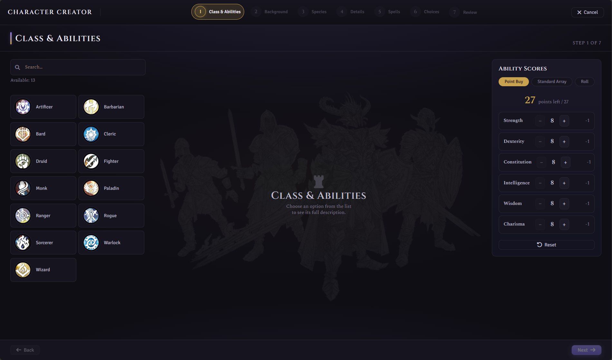
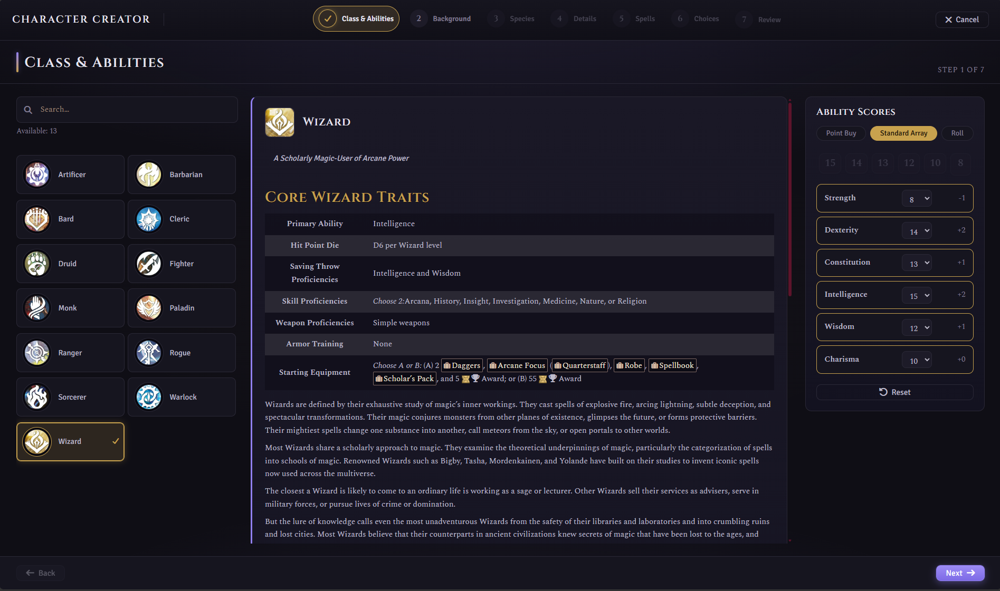
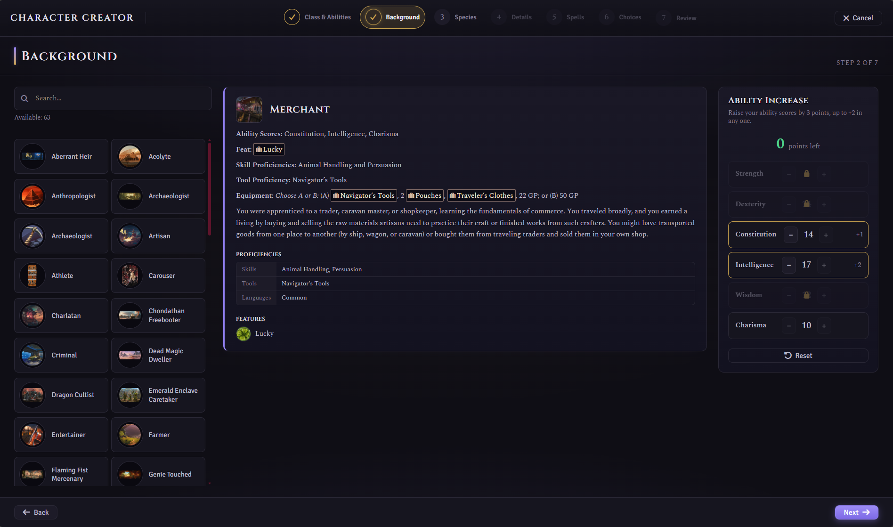
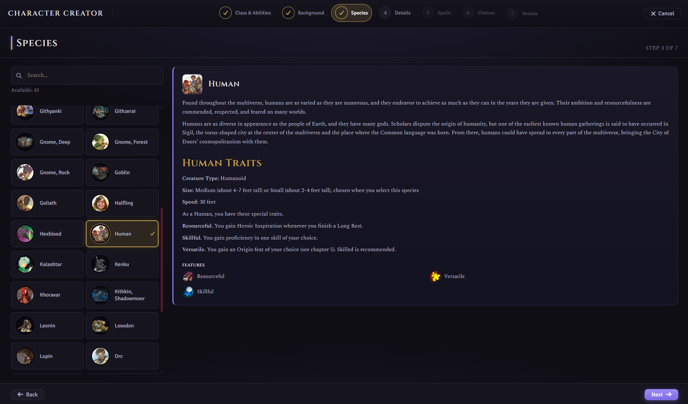
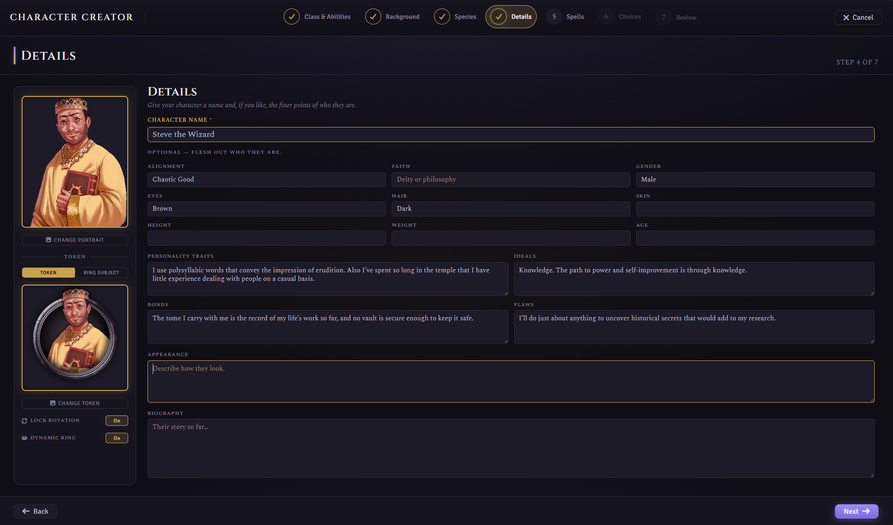
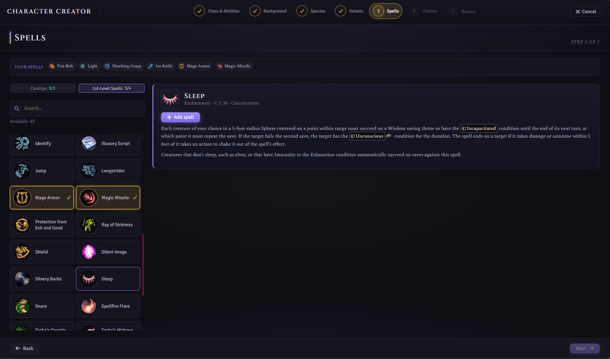
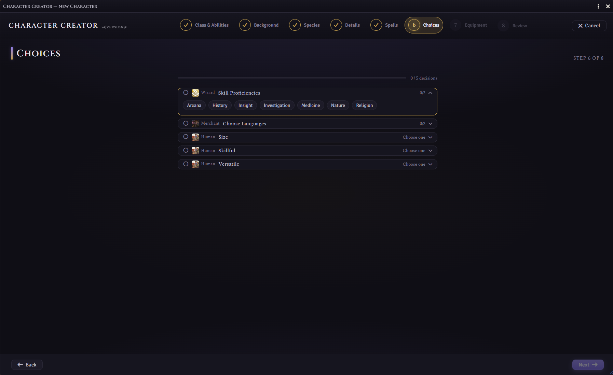
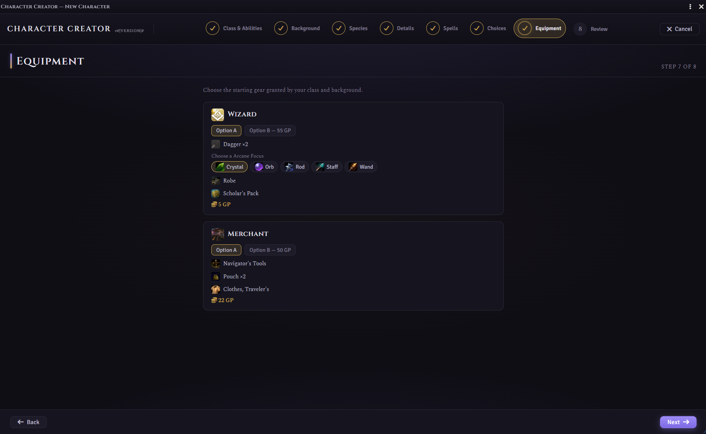
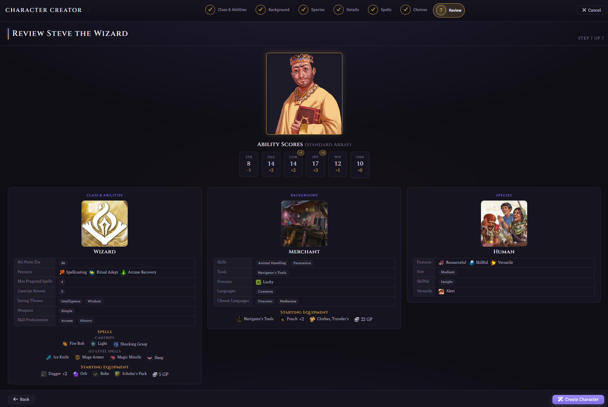
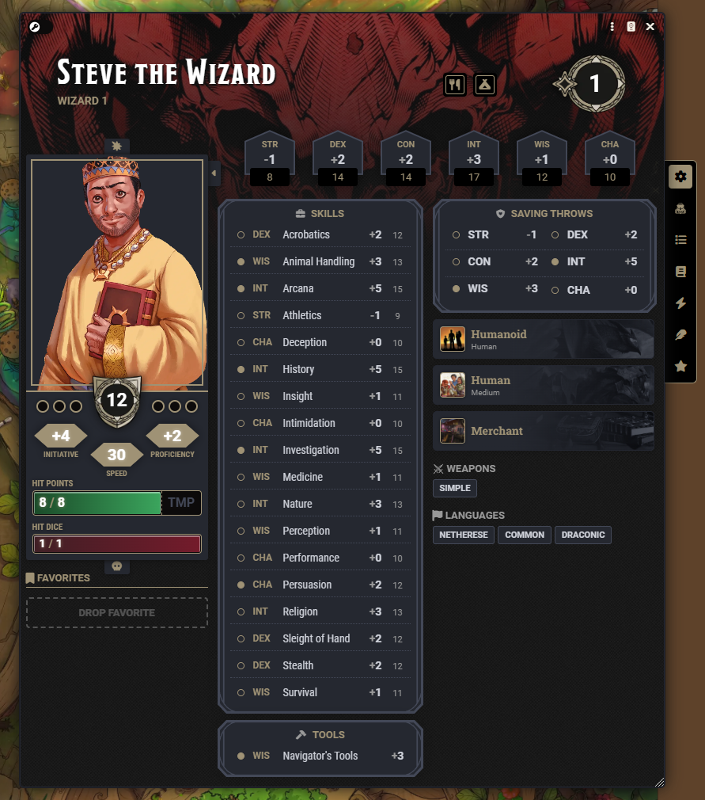

   

# Simple D&D Character Creator

**Build a brand-new D&D 5e character without the guesswork.**

This Foundry VTT module replaces the fiddly, drag-and-drop character setup with a calm, step-by-step wizard. It walks you from a blank slate to a ready-to-play hero — choosing your class, background, and species, rolling your stats, picking your spells, and naming your adventurer — all in one clean, fullscreen workflow.

If you can pick from a menu, you can build a character.

---

## Why you'll like it

- **No rulebook required.** Every option shows you its full description right there on screen, so you always know what a choice does before you commit to it.
- **Nothing gets forgotten.** The wizard guides you through each part of your character in order and won't let you finish until the essentials are done.
- **One thing at a time.** Instead of juggling sheets, compendiums, and drag-and-drop, you make one decision per screen and click **Next**.
- **It does the bookkeeping for you.** Proficiencies, starting equipment, hit points, and class features are all applied automatically when your character is created.
- **Your table, your rules.** Prefer point buy? Standard array? Rolling for stats? It's your choice, and your Game Master can set the house rules.

---

## How it works

Creating a character is as simple as clicking **Create Character** and following the steps. Each step is a single, focused screen — pick an option from the list, read about it, and move on.

### The steps

**1. Class & Abilities**
Choose what your character *does* — fighter, wizard, rogue, and the rest. You'll also set your ability scores here using whichever method your group prefers:
- **Point Buy** — spend a budget of points to customise your scores.
- **Standard Array** — assign a fixed set of solid numbers.
- **Roll** — let the dice decide.

**2. Background**
Pick where your character came from and what they did before adventuring. Backgrounds grant extra skills and an ability boost to round out who they are.

**3. Species**
Choose your character's people — their traits, features, and any special abilities come along automatically.

**4. Details**
Give your character a name, a portrait, and a token. Want to go further? Add their personality, appearance, alignment, and backstory — or leave it for later. It's entirely optional.

**5. Spells**
If your class can cast spells, this is where you pick your cantrips and starting spells. Each spell shows its full description so you know exactly what you're taking. Non-casters skip this step automatically.

**6. Choices**
Some classes, backgrounds, and species let you make extra decisions — a bonus skill, a tool proficiency, a fighting style. Any remaining choices are gathered here in one tidy list so nothing slips through the cracks.

**7. Equipment**
Kit out your hero with the starting gear your class and background provide. Pick a ready-made bundle of weapons, armour, and tools — swapping individual items where the rules let you — or take a pouch of gold to shop with later. There's always a sensible default, so you can fine-tune your loadout or breeze straight past it.

**8. Review**
A final summary of everything you've built. Happy with it? Click **Create Character** and your new hero is ready to play.

**9. Use your Actor**
That's it — your character appears in your world, fully built and ready for adventure.

---

## Getting started

1. In Foundry VTT, open the **Actors** sidebar.
2. Click the **Create Character** button.
3. Follow the steps, and click **Create Character** at the end.

---

## Options for your Game Master

The creator works great out of the box, but a few settings let your GM tailor it to your table:

- **Display mode** — open the creator **fullscreen** for an immersive, distraction-free build, or in a **draggable window** if you like to keep an eye on the rest of your screen.
- **Point-buy budget** — change how many points players get when building stats (the standard rules use 27).
- **Ability roll formula** — set the dice rolled for each ability (the standard rules use 4d6, keeping the highest three).
- **Launch button & menu entry** — show or hide the sidebar button and the right-click "Open in Character Creator" option.
- **Module mode** — choose what the module owns: **Creation only**, **Creation + Level-Up** (the default), or **Level-Up only**, which hides the creator and keeps just the guided level-up flow.
- **Multiclassing** — off by default; when enabled, players can add a whole new class from the Level Up flow. Choose whether the standard ability prerequisites (13+ in the primary ability of both classes) are enforced or waived.

---

## Module compatibility

This module is designed to sit quietly alongside the rest of your world. Where another module covers
the same ground, this one steps aside automatically — you don't need to change any settings.

| Module | Works together? | What happens |
|---|---|---|
| [Ember](https://foundryvtt.com/packages/ember) | ✅ Yes — automatic | Ember owns character creation, so this module switches itself to **Level-Up only** and restyles its level-up window to match Ember's look. The two feel like one experience. |
| [Hero Mancer](https://foundryvtt.com/packages/hero-mancer) | ❌ No — incompatible | Hero Mancer replaces the 5e advancement engine rather than building on it, so the two modules cannot share the creation and level-up space. This is declared as a conflict in the manifest and Foundry will warn you if both are enabled — run one or the other. |
| [D&D Player's Handbook (2024)](https://foundryvtt.com/packages/dnd-players-handbook) | ✅ Yes — enhanced | Fully supported as a content source, and its official artwork is used as the backdrop on the class, species, and background screens. |
| Other official content modules (Artificer, Ravenloft, Forgotten Realms, and similar) | ✅ Yes | Their classes, species, backgrounds, spells, and equipment appear in the wizard like any other compendium content. |
| Homebrew compendiums and content modules | ✅ Yes | Anything that follows the standard 5e item and advancement format is picked up automatically. |
| Alternative character sheets (Tidy 5e Sheet and similar) | ✅ Yes | This module builds the character; your sheet module displays it. They don't overlap. |
| Automation modules (Midi-QOL, DAE, and similar) | ✅ Yes | They act on characters during play, after this module has finished creating them. |

> **The short version:** the only module that changes what this one does is **Ember** (it takes over
> creation), and the only one you can't run alongside it is **Hero Mancer**. Everything else is free
> to run alongside.
>
> Modules not listed here haven't been specifically tested, but nothing in this one hooks into the
> parts of Foundry that most modules touch. If you do hit a clash, please
> [open an issue](https://github.com/IainFielding/Simple-DnD5e-Character-Creator/issues).

---

## Requirements

- **Foundry VTT** version 14 or later
- The **D&D Fifth Edition (dnd5e)** game system, version 5.3.3 or later
- Your character content (classes, species, backgrounds, spells, and equipment) enabled in your compendiums

---

*Made by [Iain Fielding](https://iainfielding.com) for the FoundryVTT - Dungeons & Dragons 5e community.*
