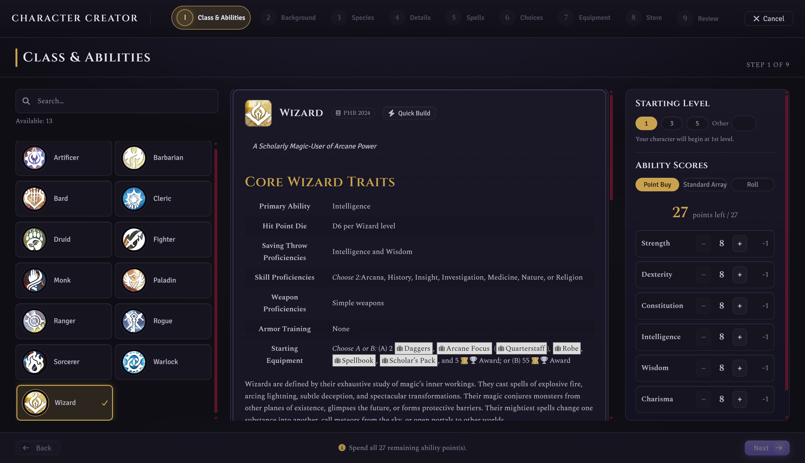
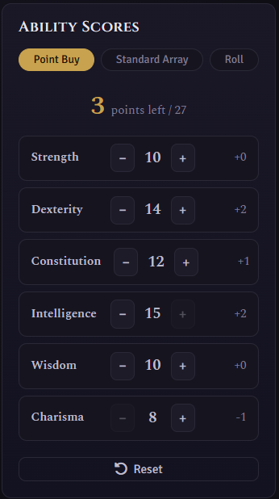
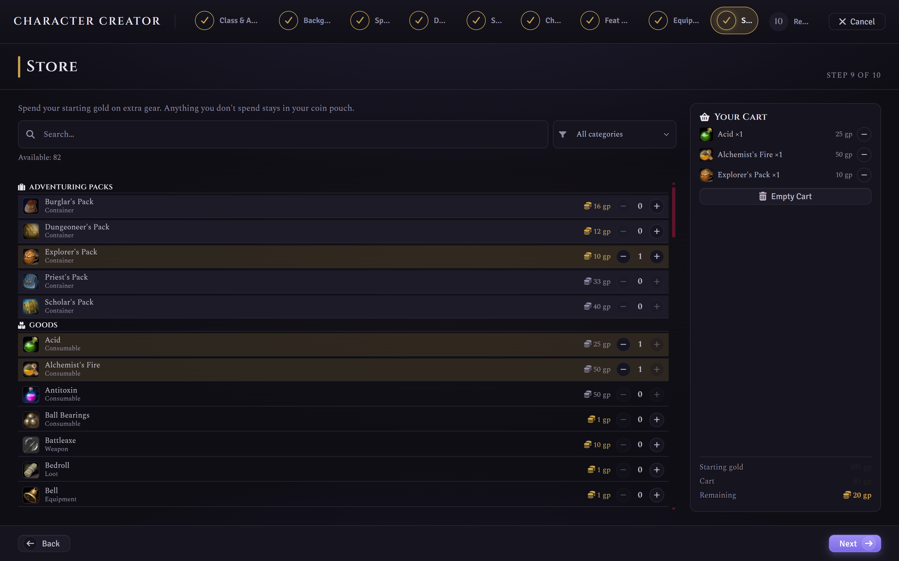
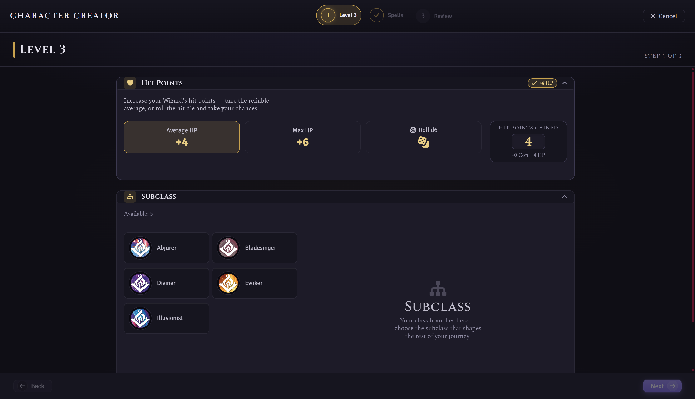
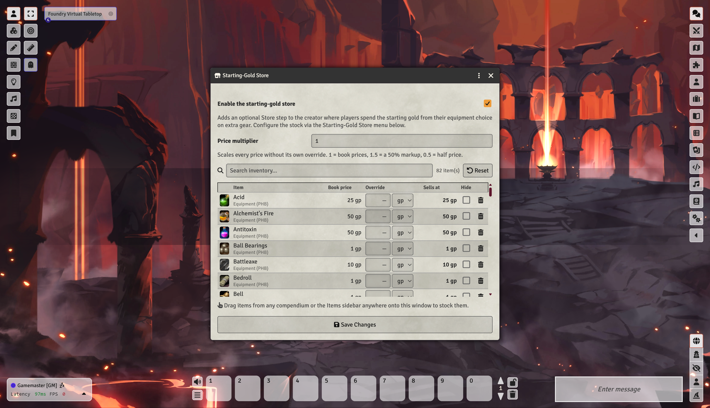

   

# Simple D&D Character Creator

**Build a brand-new D&D 5e character without the guesswork.**

This Foundry VTT module replaces the fiddly, drag-and-drop character setup with a calm, step-by-step wizard. It walks you from a blank slate to a ready-to-play hero: choosing your class, background, and species, rolling your stats, picking your spells, and naming your adventurer, all in one clean workflow. When your character grows, it hands you an equally tidy level-up wizard that guides you one screen at a time.

If you can pick from a menu, you can build a character.

*Screenshot: the welcome screen.*

---

## Why you'll like it

- **No rulebook required.** Every option shows you its full description right there on screen, so you always know what a choice does before you commit to it.
- **Nothing gets forgotten.** The wizard guides you through each part of your character in order and won't let you finish until the essentials are done.
- **One thing at a time.** Instead of juggling sheets, compendiums, and drag-and-drop, you make one decision per screen and click **Next**.
- **In a hurry? Quick Build has your back.** Pick a class, hit one button, and the wizard fills in a sensible, ready-to-play character you can tweak or run with as-is.
- **It does the bookkeeping for you.** Proficiencies, starting equipment, hit points, and class features are all applied automatically when your character is created.
- **Your table, your rules.** Prefer point buy? Standard array? Rolling for stats? It's your choice, and your Game Master can set the house rules.

---

## Getting started

1. In Foundry VTT, open the **Actors** sidebar.
2. Click the **Simple Character Builder** button at the top.
3. Follow the steps, then click **Create Character** at the end.

That's the whole trick. Everything below is just detail for when you want it.

---

## How character creation works

Each step is a single, focused screen: pick an option from the list, read about it, and move on. A progress rail down the side shows where you are and ticks off each step as you complete it.

*Screenshot: choosing a class.*

### In a hurry? Try Quick Build

See the **Quick Build** button? Give it a click after you've chosen a class and the wizard does the rest: a recommended spread of ability scores, a fitting background, a random species, a rolled name, sensible skill and feature choices, starting spells, and a default equipment pack. It drops you straight at the Review step with a complete character. Nothing is locked in, so you can hop back and change anything you like before you hit Create.

*Screenshot: the Quick Build button on the class step.*

### The steps

**1. Class & Abilities**
Choose what your character *does*: fighter, wizard, rogue, and the rest. You'll also set your ability scores here using whichever method your group prefers:
- **Point Buy** lets you spend a budget of points to customise your scores.
- **Standard Array** assigns a fixed set of solid numbers.
- **Roll** lets the dice decide.

Starting above 1st level? If your GM allows it, pick a **Starting Level** here. You'll build level 1 in the creator, then finish the climb to your chosen level in the level-up wizard.

*Screenshot: setting ability scores.*

**2. Background**
Pick where your character came from and what they did before adventuring. Backgrounds grant extra skills and an ability boost to round out who they are.

*Screenshot: choosing a background.*

**3. Species**
Choose your character's people. Their traits, features, and any special abilities come along automatically.

*Screenshot: choosing a species.*

**4. Details**
Give your character a name, a portrait, and a token. Stuck on a name? Hit the dice button for a **random name** in your species' style (with optional gender and style tweaks). Want to go further? Add personality, appearance, alignment, and backstory, or leave it for later. It's entirely optional.

*Screenshot: the details screen and random name roller.*

**5. Spells**
If your class can cast spells, this is where you pick your cantrips and starting spells. Each spell shows its full description so you know exactly what you're taking. Non-casters skip this step automatically.

*Screenshot: picking spells.*

**6. Feat Spells**
Some choices (Magic Initiate and friends) grant a little extra magic. When they do, this step lets you pick the spell list, the casting ability, and the spells themselves. No spell-granting feats? This step politely bows out.

**7. Choices**
Some classes, backgrounds, and species let you make extra decisions: a bonus skill, a tool proficiency, a fighting style. Any remaining choices are gathered here in one tidy list so nothing slips through the cracks.

*Screenshot: the choices step.*

**8. Equipment**
Kit out your hero with the starting gear your class and background provide. Pick a ready-made bundle of weapons, armour, and tools (swapping individual items where the rules let you) or take a pouch of gold to shop with later. There's always a sensible default, so you can fine-tune your loadout or breeze straight past it.

*Screenshot: choosing starting equipment.*

**9. Store** *(optional, if your GM enables it)*
Took the gold instead of a gear pack? Spend it here. Browse the shelves your GM has stocked, drop items into your cart, and watch your remaining coin tick down. Anything you don't spend stays in your pocket for later.

*Screenshot: the store step, spending starting gold.*

**10. Review**
A final summary of everything you've built. Happy with it? Click **Create Character** and your new hero is ready to play.

*Screenshot: the review screen.*

**11. Use your Actor**
That's it. Your character appears in your world, fully built and ready for adventure.

*Screenshot: the finished actor.*

---

## Levelling up

Characters grow, and this module makes that just as painless as building them. When it's time to level up, you get the same calm, one-screen-at-a-time treatment.

**How to level up:**
- Click the **Level Up** button on your character sheet's header, or
- Right-click your character in the Actors sidebar and choose **Level Up**.

The level-up wizard walks you through everything that new level brings, one screen per level gained:

- **Hit Points.** Take the reliable average or roll your hit die and take your chances (your GM decides which options are on the table).
- **Subclass.** When your class branches, choose the path that shapes the rest of your journey.
- **Ability Scores or a Feat.** Spend your improvement on raising abilities, or take a feat instead.
- **Features and Weapon Mastery.** Pick any new choices your class hands you.
- **Spells.** Casters choose their newly learned spells, and can swap out a spell they already know where the rules allow.
- **Review.** See exactly what changed (new HP, features, spells, proficiency bonus, spell slots) before you apply it.

Nothing touches your character until you click **Apply Level-Up**, so you can back out any time.

**Multiclassing** is supported too, when your GM turns it on. From the class step you can begin a brand-new class at level 1 alongside your existing ones, and the wizard keeps the labels clear (like "Wizard 3") so you always know which class is gaining the level.

*Screenshot: the level-up wizard, one screen per level.*

---

## The GM's Guide

The creator works great straight out of the box, but a handful of settings let you tailor it to your table. You'll find them under **Configure Settings, Module Settings**.

### Core settings

- **Module mode.** Choose what the module owns: **Creation only**, **Creation + Level-Up** (the default), or **Level-Up only**, which hides the creator and keeps just the guided level-up flow.
- **Display mode.** Open the creator **fullscreen** for an immersive, distraction-free build, or in a **draggable, resizable window** if you like to keep an eye on the rest of your screen.
- **Show launch button.** Show or hide the "Simple Character Builder" button in the Actors sidebar.
- **Show Level Up button.** Show or hide the Level Up button on the character sheet header.
- **Show Level Up in right-click menu.** Show or hide the right-click "Level Up" entry on characters in the sidebar.

### Ability scores

- **Point-buy budget.** Change how many points players get when building stats (the standard rules use 27).
- **Ability roll formula.** Set the dice rolled for each ability (the standard rules use `4d6kh3`, four d6 keeping the highest three).

### Level-up options

- **Multiclassing.** Off by default. When enabled, players can add a whole new class from the level-up flow. Choose whether the standard ability prerequisites (13+ in the primary ability of both classes) are enforced or waived.
- **Level-up hit points.** Decide what HP options players see: **Player's choice** (average, max, roll, or manual), **Average or roll** (matching the written rules), or **Average only** (applied automatically).
- **Post hit-die rolls to chat.** When a player rolls for HP, share the result with the whole table.

### The Starting-Gold Store

Want players to shop with their starting gold instead of grabbing a gear pack? Flip on **Enable the starting-gold store** and an optional Store step appears in the creator.

You curate what's on the shelves through the **Starting-Gold Store** menu (the "Configure Store" button in settings):

- **Drag items in** from any compendium or the Items sidebar to stock them.
- **Set a price override** per item, or apply a global **price multiplier** (1 = book prices, 1.5 = a 50% markup, 0.5 = half price).
- **Hide or remove** anything you don't want on offer.
- **Reset** at any time to restore the factory default stock.

Nothing is saved until you press **Save Changes**, so closing the window is a handy undo for a botched drag.

*Screenshot: the GM store configuration window.*

---

## Module compatibility

This module is designed to sit quietly alongside the rest of your world. Where another module covers the same ground, this one steps aside automatically, so you don't need to change any settings.

| Module | Works together? | What happens |
|---|---|---|
| [Ember](https://foundryvtt.com/packages/ember) | Yes, automatic | Ember owns character creation, so this module switches itself to **Level-Up only** and restyles its level-up window to match Ember's look. The two feel like one experience. |
| [Hero Mancer](https://foundryvtt.com/packages/hero-mancer) | No, incompatible | Hero Mancer replaces the 5e advancement engine rather than building on it, so the two modules cannot share the creation and level-up space. This is declared as a conflict in the manifest, and Foundry will warn you if both are enabled. Run one or the other. |
| [D&D Player's Handbook (2024)](https://foundryvtt.com/packages/dnd-players-handbook) | Yes, enhanced | Fully supported as a content source, and its official artwork is used as the backdrop on the class, species, and background screens. |
| Other official content modules (Artificer, Ravenloft, Forgotten Realms, and similar) | Yes | Their classes, species, backgrounds, spells, and equipment appear in the wizard like any other compendium content. |
| Homebrew compendiums and content modules | Yes | Anything that follows the standard 5e item and advancement format is picked up automatically. |
| Alternative character sheets (Tidy 5e Sheet and similar) | Yes | This module builds the character; your sheet module displays it. They don't overlap. |
| Automation modules (Midi-QOL, DAE, and similar) | Yes | They act on characters during play, after this module has finished creating them. |

> **The short version:** the only module that changes what this one does is **Ember** (it takes over creation), and the only one you can't run alongside it is **Hero Mancer**. Everything else is free to run together.
>
> Modules not listed here haven't been specifically tested, but nothing in this one hooks into the parts of Foundry that most modules touch. If you do hit a clash, please [open an issue](https://github.com/IainFielding/Simple-DnD5e-Character-Creator/issues).

---

## Requirements

- **Foundry VTT** version 14 or later
- The **D&D Fifth Edition (dnd5e)** game system, version 5.3.3 or later
- Your character content (classes, species, backgrounds, spells, and equipment) enabled in your compendiums

---

*Made by [Iain Fielding](https://iainfielding.com) for the FoundryVTT Dungeons & Dragons 5e community.*
