 

 [](https://ko-fi.com/sogrom)<br>

# Simple D&D Character Creator

**Build a brand-new D&D 5e character without the guesswork.**

This Foundry VTT module replaces the fiddly, drag-and-drop character setup with a calm, step-by-step wizard. It walks you from a blank slate to a ready-to-play hero: choosing your class, background, and species, rolling your stats, picking your spells, and naming your adventurer, all in one clean workflow. When your character grows, it hands you an equally tidy level-up wizard that guides you one screen at a time.

If you can pick from a menu, you can build a character.

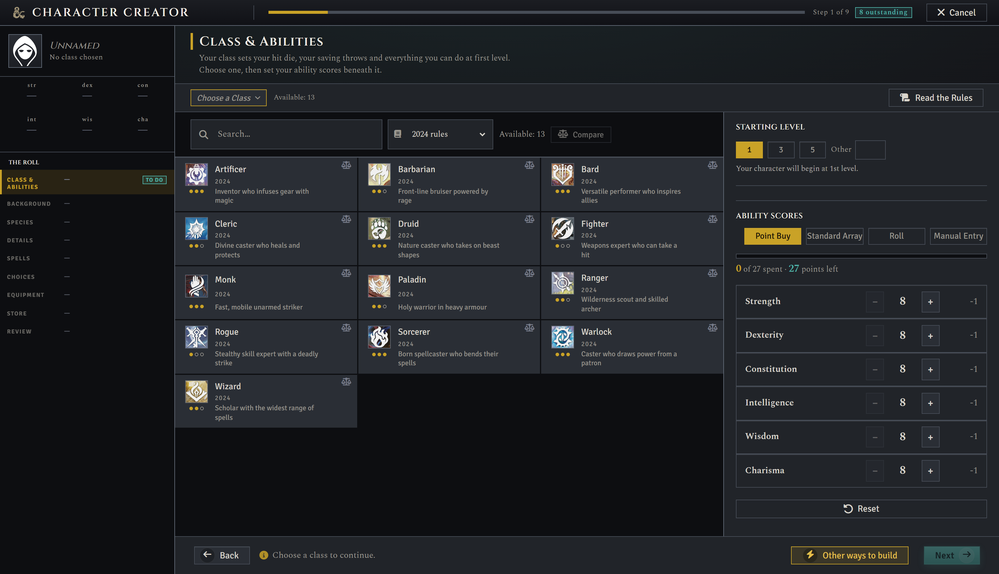
*Screenshot: the first screen — pick a class, set your scores.*

---

## Why you'll like it

- **No rulebook required.** Every option shows you its full description right there on screen, so you always know what a choice does before you commit to it.
- **Nothing gets forgotten.** The wizard guides you through each part of your character in order and won't let you finish until the essentials are done.
- **One thing at a time.** Instead of juggling sheets, compendiums, and drag-and-drop, you make one decision per screen and click **Next**.
- **Three ways in, and you pick.** The creator opens by asking how you want to build: step by step, a quick build from three choices, or a ready-made character you can play in a minute. They all end in the same place, with everything still yours to change.
- **In a hurry? Quick Build has your back.** Choose a class, a species and a background — or roll all three — and the wizard fills in everything else: ability scores, skills, spells and kit.
- **Or start from a finished character.** The D&D system and several content modules ship pregenerated heroes. The creator gathers up the 1st-level ones and lets you take any of them as your own.
- **Torn between two options? Put them side by side.** Pin the classes, species, backgrounds or subclasses you are weighing up and read them as a comparison table — hit dice, proficiencies, features and all — instead of clicking back and forth trying to remember the last one.
- **Close it and come back later.** Half-built characters aren't lost. Close the window and the creator offers to keep what you've done as a draft; open it next time — tomorrow, or on another computer — and it asks whether you'd like to pick up where you left off.
- **It does the bookkeeping for you.** Proficiencies, starting equipment, hit points, and class features are all applied automatically when your character is created.
- **Your table, your rules.** Prefer point buy? Standard array? Rolling for stats? It's your choice, and your Game Master can set the house rules.

---

## Getting started

1. In Foundry VTT, open the **Actors** sidebar.
2. Click the **Simple Character Builder** button at the top.
3. Follow the steps, then click **Create Character** at the end.

That's the whole trick. Everything below is just detail for when you want it.

---

## How character creation works

Each step is a single, focused screen: pick an option from the list, read about it, and move on. A progress rail down the side shows where you are and ticks off each step as you complete it.

Want the actual rule rather than our summary? A **Read the Rules** button on the Class, Species, Background and Details screens opens that step's own page from the rulebook you already own — the Player's Handbook if you have it, the free rules otherwise — in the same reader the "Full Details" button uses. It follows your character's edition, so a 2014 build gets the 2014 chapters. No book installed for it? The button simply doesn't appear.

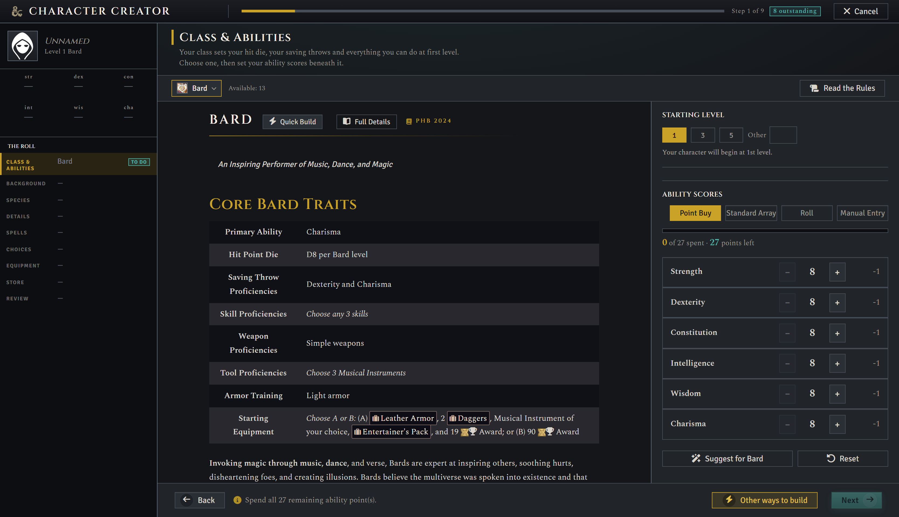
*Screenshot: choosing a class.*

### In a hurry? Try Quick Build

Quick Build is one of the three ways in, and it asks for three things: a class, a species and a background. Each has a die beside it if you would rather leave it to chance, and there is a **Roll everything** button if you would rather leave all of it to chance.

Everything else is decided for you — a recommended spread of ability scores, a rolled name, sensible skill and feature choices, starting spells, and a default equipment pack — and shown to you before you commit. **Create Character** then builds it. Nothing is locked in: every pick is still editable on the character afterwards, and **Build step by step instead** carries whatever you have chosen into the full wizard.

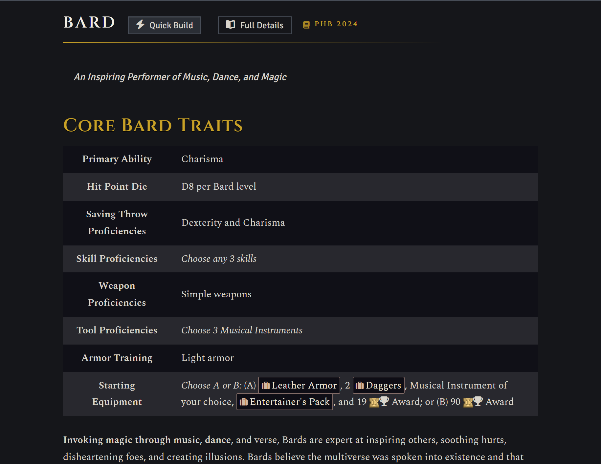
*Screenshot: the Quick Build button on the class step.*

### Or take a ready-made character

The D&D system ships twelve finished 1st-level characters, one per class, and some content modules ship more. **Ready-made** gathers up whichever of those your world has, grouped by the book they came from, and hands you one as a real character of your own — already built, already correct, and yours to edit.

Your GM can set which of the three ways is marked **Recommended** in the module settings, for the benefit of a player who has not built a character before.

### Can't decide? Compare them side by side

Quick Build is for when you don't want to choose. This is for when you know exactly what you're choosing *between*.

Every option in the Class, Species, Background and subclass lists has a small **scales** icon beside it. Click it to pin that option — pin two, three or four — and the **Compare** button at the top of the list lays them out as a table: one column per option, one row per thing that differs. Hit die, primary ability, saving throws, proficiencies, ability increases, spellcasting, the level a subclass unlocks, and every feature and spell each one grants.

Pinning is not choosing, so you can weigh up two subclasses without either one becoming your answer. Nothing you pin is saved — close the window and the pins go with it.

### The steps

**1. Class & Abilities**
Choose what your character *does*: fighter, wizard, rogue, and the rest. You'll also set your ability scores here using whichever method your group prefers:
- **Point Buy** lets you spend a budget of points to customise your scores.
- **Standard Array** assigns a fixed set of solid numbers.
- **Roll** lets the dice decide.
- **Manual Entry** lets you type the six numbers straight in — for scores rolled at the table, carried over from another game, or handed out by your GM. Your GM has to turn this one on.

Whichever you use, switching between them keeps what you had under the others, so you can try point buy, roll a set, and go back without losing either.

Starting above 1st level? If your GM allows it, pick a **Starting Level** here. You'll build level 1 in the creator, then finish the climb to your chosen level in the level-up wizard.

Running both editions of the rules in one world? Your class choice sets which one you're playing, and everything after it follows suit — the Background, Species and subclass screens show only content from the same edition, so you can't accidentally end up with a mix. Pick a card and its detail panel names the book it came from.

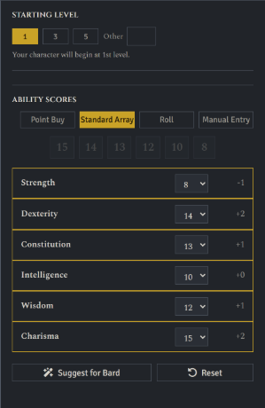
*Screenshot: setting ability scores.*

**2. Background**
Pick where your character came from and what they did before adventuring. Backgrounds grant extra skills and an ability boost to round out who they are.

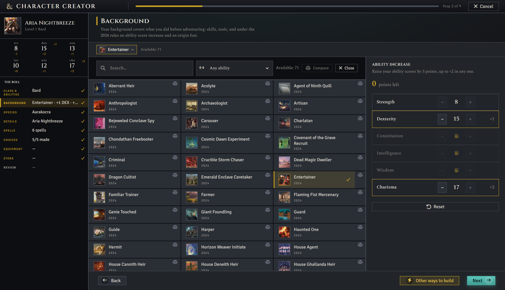
*Screenshot: choosing a background.*

**3. Species**
Choose your character's people. Their traits, features, and any special abilities come along automatically.

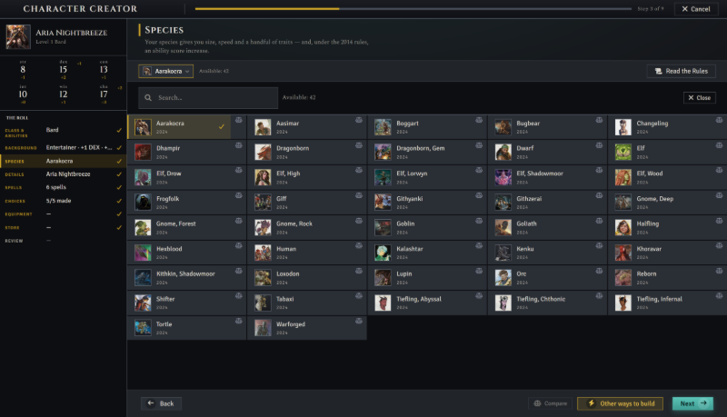
*Screenshot: choosing a species.*

**4. Details**
Give your character a name, a portrait, and a token. Stuck on a name? Hit the dice button for a **random name** in your species' style (with optional gender and style tweaks). Want to go further? Add personality, appearance, alignment, and backstory, or leave it for later. It's entirely optional.

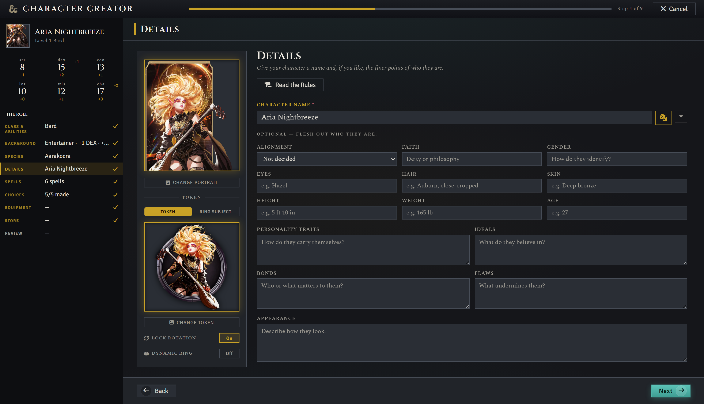
*Screenshot: the details screen and random name roller.*

**5. Spells**
If your class can cast spells, this is where you pick your cantrips and starting spells. Each spell shows its full description so you know exactly what you're taking. Non-casters skip this step automatically.

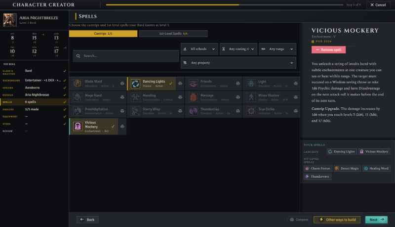
*Screenshot: picking spells.*

**6. Choices**
Some classes, backgrounds, and species let you make extra decisions: a bonus skill, a tool proficiency, a fighting style. Any remaining choices are gathered here in one tidy list so nothing slips through the cracks. If your game uses Tasha's optional class features, a 2014-rules class lists its level-1 ones here too. You have them all by default, and you can give one up or swap a feature for its Tasha's version, such as Favored Foe in place of Favored Enemy.

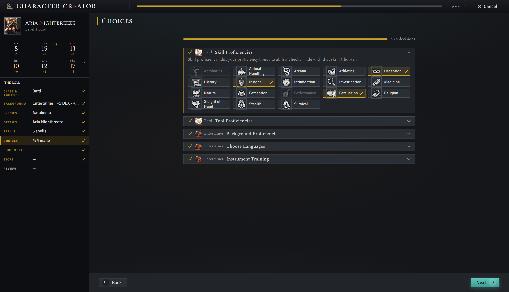
*Screenshot: the choices step.*

**7. Feat Spells**
Some choices (Magic Initiate and friends) grant a little extra magic. When they do, this step lets you pick the spell list, the casting ability, and the spells themselves. No spell-granting feats? This step politely bows out.

**8. Equipment**
Kit out your hero with the starting gear your class and background provide. Pick a ready-made bundle of weapons, armour, and tools (swapping individual items where the rules let you) or take a pouch of gold to shop with later. There's always a sensible default, so you can fine-tune your loadout or breeze straight past it.

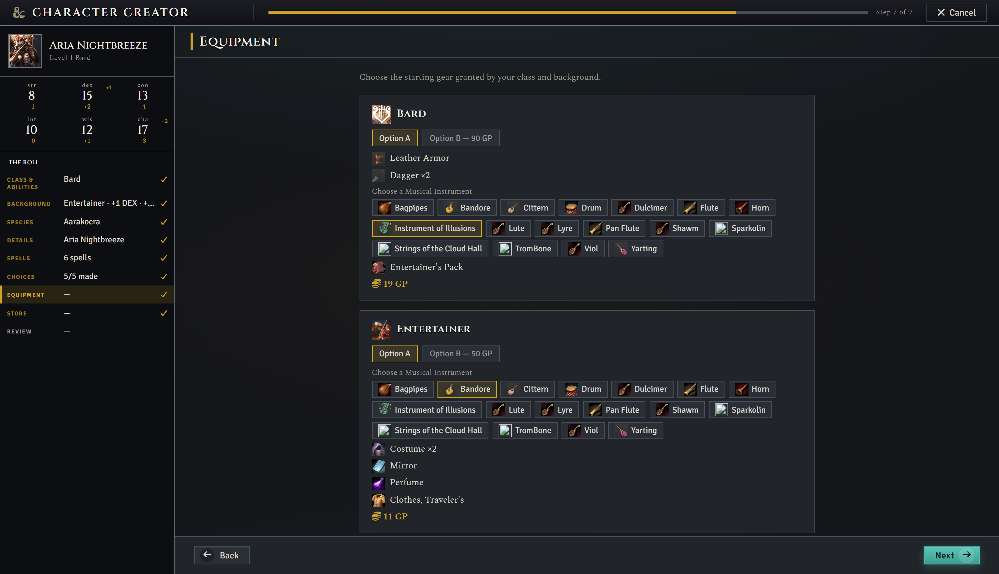
*Screenshot: choosing starting equipment.*

**9. Store** *(optional, if your GM enables it)*
Took the gold instead of a gear pack? Spend it here. Browse the shelves your GM has stocked, drop items into your cart, and watch your remaining coin tick down. Anything you don't spend stays in your pocket for later.

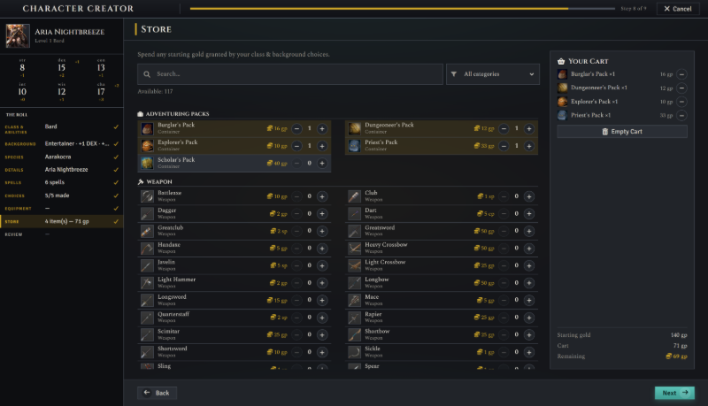
*Screenshot: the store step, spending starting gold.*

**10. Review**
A final summary of everything you've built. Happy with it? Click **Create Character** and your new hero is ready to play.

Want it on paper? If you have the companion [Simple D&D PDF Character sheet](https://foundryvtt.com/packages/sogrom-dnd5e-character-sheet-pdf) module (2.2.0 or later), an **Export Character Sheet PDF** tick box appears here — leave it ticked and a filled-in official character sheet is produced the moment your character is finished, in the 2014 or the 2024 layout to match the edition your class was written for. The same tick box sits on the level-up review, so you can print a fresh sheet each time your character grows. Without that module the tick box simply isn't there, and the review screen reads exactly as it always did.

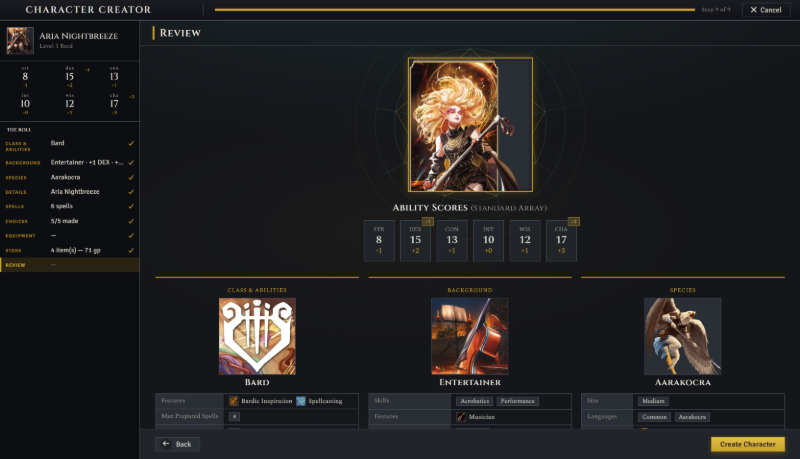
*Screenshot: the review screen.*

**11. Use your Actor**
That's it. Your character appears in your world, fully built and ready for adventure.

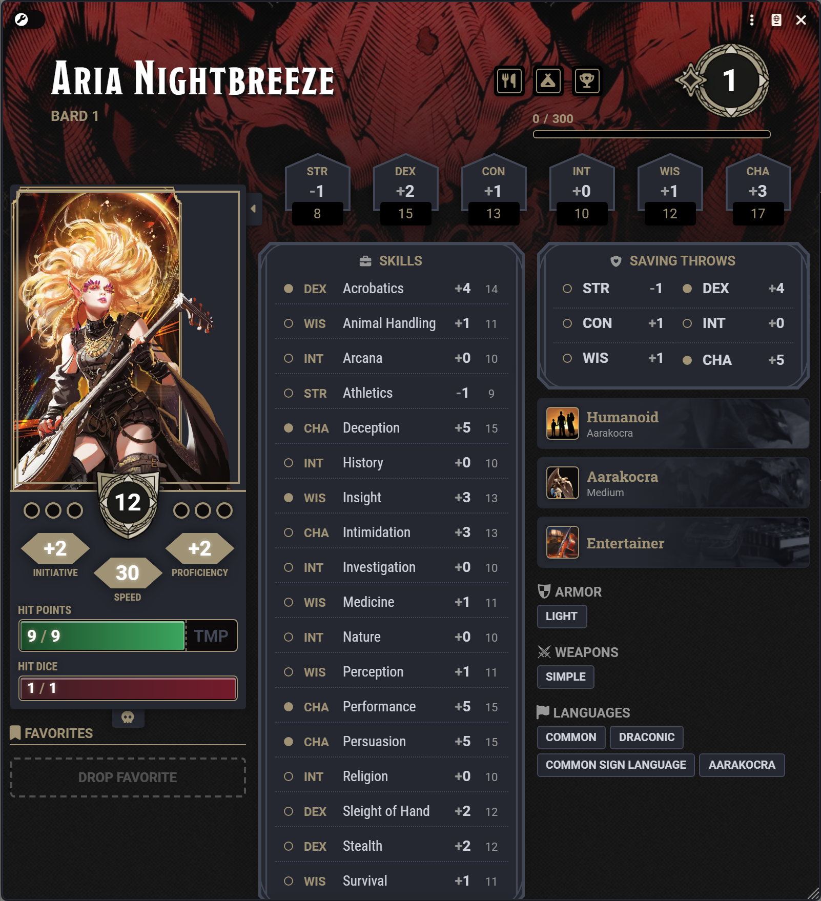
*Screenshot: the finished actor.*

---

## Levelling up

Characters grow, and this module makes that just as painless as building them. When it's time to level up, you get the same calm, one-screen-at-a-time treatment.

**How to level up:**
- Click the **Level Up** button on your character sheet's header, or
- Right-click your character in the Actors sidebar and choose **Level Up**.

The level-up wizard walks you through everything that new level brings, one screen per level gained:

- **Hit Points.** Take the reliable average or roll your hit die and take your chances (your GM decides which options are on the table).
- **Subclass.** When your class branches, choose the path that shapes the rest of your journey.
- **Ability Scores or a Feat.** Spend your improvement on raising abilities, or take a feat instead.
- **Features and Weapon Mastery.** Pick any new choices your class hands you.
- **Optional Features.** If your game uses the optional class features from Tasha's Cauldron of Everything, this screen is where you take them or leave them — including the ones that *replace* an older feature, where you pick which version your character uses.
- **Spells.** Casters choose their newly learned spells, and can swap out a spell they already know where the rules allow.
- **Review.** See exactly what changed (new HP, features, spells, proficiency bonus, spell slots) before you apply it.

Nothing touches your character until you click **Apply Level-Up**, so you can back out any time.

**Skipped a choice?** D&D 5e lets a level finish with a choice left unmade: a fighting style never picked, an ability score improvement never spent, a subclass never chosen. When that happens, a **wrench** appears beside the Level Up button (and in the same menus). Click it to reopen the level-up wizard on just that level's missing choices. Everything you already chose stays exactly as it was, and a subclass picked late brings every feature it would have given you since. If more than one level needs attention, you choose which one to fix first. The wrench disappears once nothing is left unanswered, and it still works on a level-20 character.

**Multiclassing** is supported too, when your GM turns it on. From the class step you can begin a brand-new class at level 1 alongside your existing ones, and the wizard keeps the labels clear (like "Wizard 3") so you always know which class is gaining the level.

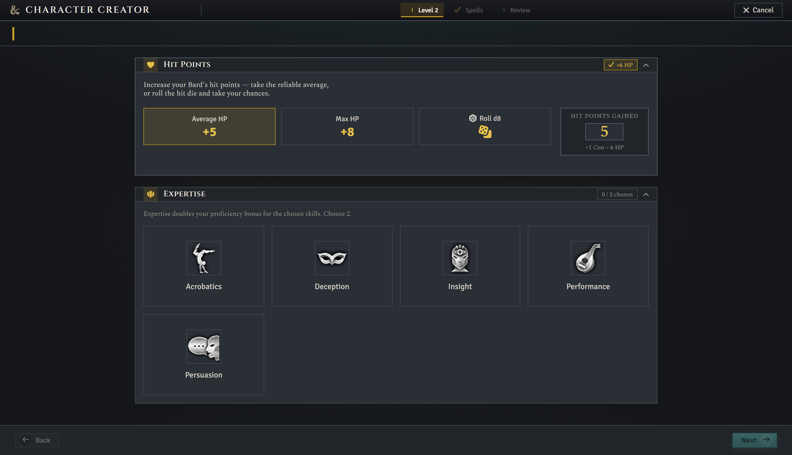
*Screenshot: the level-up wizard, one screen per level.*

---

## Running alongside Ember

[Ember](https://foundryvtt.com/packages/ember) brings its own character builder, and the two don't fight over it. With Ember enabled, this module stands down from creation automatically — no setting to change — and does two things instead.

**It answers the questions Ember leaves to the system.** Ember picks your ancestry, culture, path, class, and ability scores, then hands the level-1 decisions — skills, hit points, spells — to the D&D 5e system to ask. Those are exactly the screens this module already builds, so it takes them over: the same guided one-thing-at-a-time flow, plus the starting equipment and store steps Ember's hand-off doesn't cover.

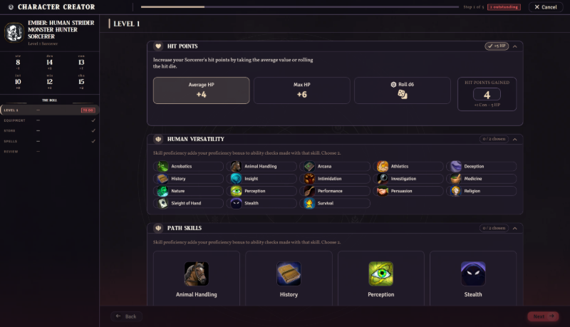
*Screenshot: the level-1 questions from an Ember build, answered in this module's wizard.*

**It restyles itself to match.** Both windows swap to a skin built to sit beside Ember's own UI, so the join between the two isn't jarring.

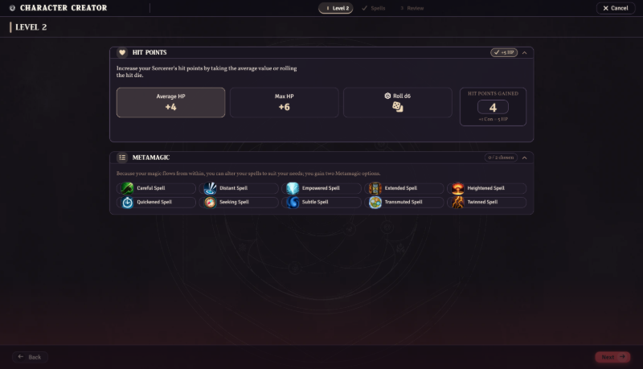
*Screenshot: the same level-up wizard in an Ember world.*

Everything else works as it does anywhere else — level-ups, multiclassing, and the GM settings below all apply.

---

## The GM's Guide

The creator works great straight out of the box, but a handful of settings let you tailor it to your table. You'll find them under **Configure Settings, Module Settings**.

### Core settings

These sit directly in the module's settings list.

- **Module mode.** Choose what the module owns: **Creation only**, **Creation + Level-Up** (the default), or **Level-Up only**, which hides the creator and keeps just the guided level-up flow.
- **Display mode.** Open the creator **fullscreen** for an immersive, distraction-free build, or in a **draggable, resizable window** if you like to keep an eye on the rest of your screen.
- **Show launch button.** Show or hide the "Simple Character Builder" button in the Actors sidebar.
- **Post a character summary to chat.** A card with the character's portrait, class and level, species, background, the six ability scores, hit points and armour class. It appears once the character is genuinely finished — if the player is starting above 1st level, the card waits until they've climbed to the level they asked for, so it shows the hero they actually made. Choose **Post to everyone**, **Whisper to the GM**, or **Don't post**.
- **Debug logging.** Off by default, and set per person rather than for the whole world — it only affects your own browser console. Turn it on if you've been asked for details about a problem, then reproduce it and share what the console prints.

> In an Ember world the creation card isn't posted. Ember finishes the character after this module's part is done, so announcing it here would be jumping the gun — level-up cards work as normal.

Everything else lives behind one of four buttons in that same list: **House Rules**, **Level-Up Options**, **Store**, and **Magic Items**.

### House Rules

The **Configure House Rules** button holds what a player is allowed to build.

- **Point-buy budget.** Change how many points players get when building stats (the standard rules use 27).
- **Ability roll formula.** Set the dice rolled for each ability (the standard rules use `4d6kh3`, four d6 keeping the highest three).
- **Allow manual ability scores.** Off by default. Turn it on to add a fourth method where players type the six numbers in themselves. It ignores the point-buy budget, the standard array and the roll formula entirely, so it's for tables where the scores are decided somewhere other than this window. Turn it back off and any character mid-build simply reverts to point buy.
- **Multiclassing.** Off by default. When enabled, players can add a whole new class from the level-up flow. Choose whether the standard ability prerequisites (13+ in the primary ability of both classes) are enforced or waived.
- **Alignments.** Tick any alignment you don't want at your table and it disappears from the Details step. Characters already using it keep it, and players can still write their own with the **Other…** option.

### Level-Up Options

The **Configure Level-Up** button holds everything about levelling.

**Starting a level-up** — where the button appears:

- **Show Level Up button** on the character sheet header.
- **Show Level Up in sheet menu**, the ⋯ menu in the sheet's header.
- **Show Level Up in right-click menu** on characters in the Actors sidebar.

Each of these also carries **Repair skipped choices** while a character has a level with an unmade choice.

**Hit points:**

- **Level-up hit points.** Decide what HP options players see: **Player's choice** (average, max, roll, or manual), **Average or roll** (matching the written rules), or **Average only** (applied automatically).
- **Post hit-die rolls to chat.** When a player rolls for HP, share the result with the whole table.

**Announcements:**

- **Post a level-up summary to chat.** A card with what the level brought: the class levels gained, hit points, proficiency bonus, any change to spell slots, a new subclass, and lists of the new features and spells.
- **Announce when a character can level up.** When a character earns enough XP for the next level, a card with a **Level Up** button is whispered to the GM — or to the GM *and* the player, if you'd rather they didn't have to wait to be noticed. Off, GM-only (the default), or both. Only applies in worlds that level by XP, and it fires once per threshold rather than nagging.

### The Starting-Gold Store

Want players to shop with their starting gold instead of grabbing a gear pack? Flip on **Enable the starting-gold store** and an optional Store step appears in the creator.

You curate what's on the shelves through the **Starting-Gold Store** menu (the "Configure Store" button in settings):

- **Drag items in** from any compendium or the Items sidebar to stock them.
- **Set a price override** per item, or apply a global **price multiplier** (1 = book prices, 1.5 = a 50% markup, 0.5 = half price).
- **Hide or remove** anything you don't want on offer.
- **Reset** at any time to restore the factory default stock.

Nothing is saved until you press **Save Changes**, so closing the window is a handy undo for a botched drag.

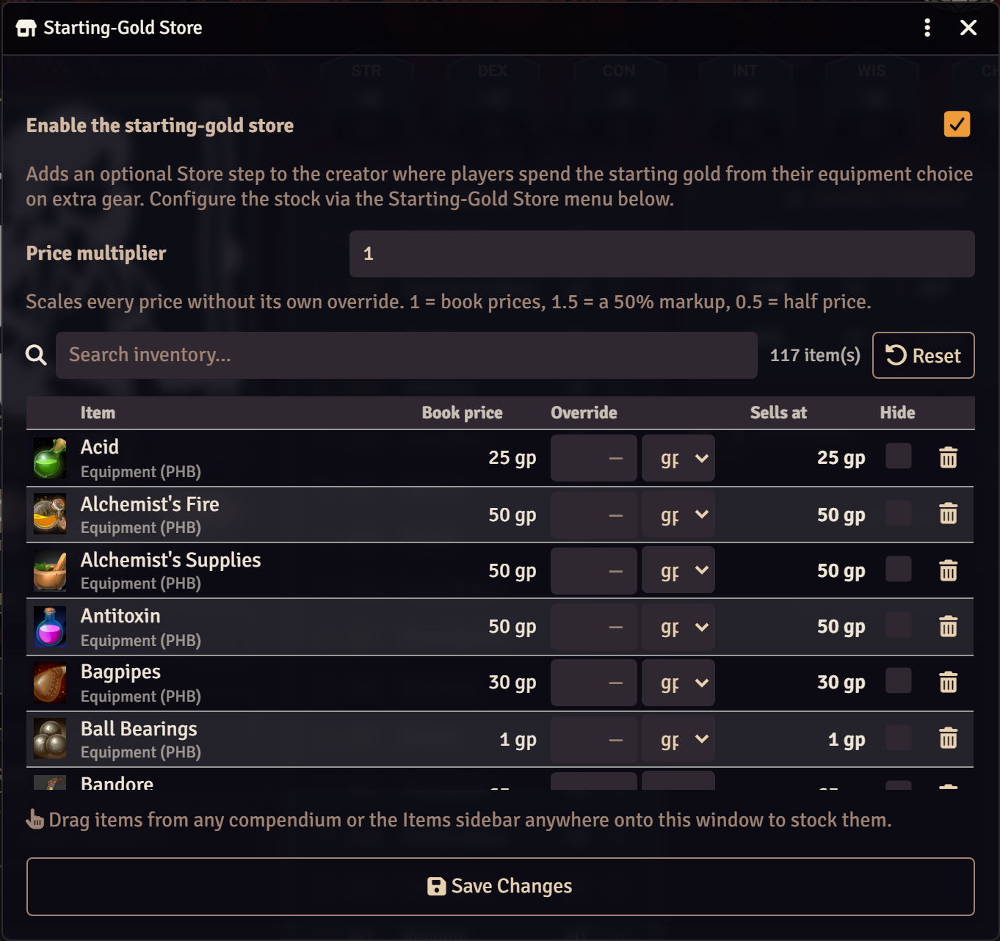
*Screenshot: the GM store configuration window.*

### The Magic Item Shop

A character who starts above 1st level would, by the Dungeon Master's Guide, arrive with extra gold and a few magic items. The Magic Item Shop hands those over. It's off by default. Open the **Magic Item Shop** menu (the "Configure Magic Items" button in settings) and tick **Enable the magic item shop** to turn it on.

With it on, a **Magic Items** step appears at the end of the climb to the starting level, just before the final review. There the player:

- **Rolls their bonus gold.** A single d10 is rolled on the screen and then locked, and the gold goes straight into the character's purse.
- **Picks free magic items** up to the number allowed at each rarity. A slot can also hold an item of a lower rarity, so an uncommon slot will take a common item. Cards flag an item the character isn't proficient with, is too weak to wear, or can't attune to because it requires a particular class or a spellcaster (for example, "Attunement by a Bard"). That flag is only a note, because a player may want something for later or for a friend.

A character starting at 1st level never sees the step, and neither does a normal level-up.

The window has two tabs:

- **Wealth Table.** The four level bands from the DMG (2–4, 5–10, 11–16 and 17–20), each with a base gold amount, gold per d10, and how many items of each rarity the player may pick. Change any number to suit your table, or press **Reset to DMG** to put the book values back.
- **Inventory.** What's on offer. The shop starts empty, so stock it first. **Drag in** a single magic item, a compendium folder (subfolders included) or a whole compendium, and only items with a rarity are added. Search the list, **hide** or **remove** anything you don't want on offer, or **Clear All** to start again. The Dungeon Master's Guide's enchantment templates, such as *+1 Weapon* or *Wand of the War Mage*, are expanded into one item for every enchantment and base item they allow.

As with the Store, nothing is saved until you press **Save Changes**.

---

## Module compatibility

This module is designed to sit quietly alongside the rest of your world. Where another module covers the same ground, this one steps aside automatically, so you don't need to change any settings.

| Module | Works together? | What happens |
|---|---|---|
| [Ember](https://foundryvtt.com/packages/ember) | Yes, automatic | Ember owns character creation, so this module switches itself to **Level-Up only**, takes over the level-1 questions Ember hands to the system, and restyles both windows to match Ember's look. See [Running alongside Ember](#running-alongside-ember). |
| Modules that want to handle *some* level-ups | Yes | There's a published hook (`preLevelUpTakeover`) another module can use to claim an individual level-up, which makes this one stand aside and hand it back to the native D&D 5e wizard — no blanket conflict needed. See [For module developers](#for-module-developers). |
| [D&D Player's Handbook (2024)](https://foundryvtt.com/packages/dnd-players-handbook) | Yes, enhanced | Fully supported as a content source, and its official artwork is used as the backdrop on the class, species, and background screens. |
| Other official content modules (Artificer, Ravenloft, Forgotten Realms, and similar) | Yes | Their classes, species, backgrounds, spells, and equipment appear in the wizard like any other compendium content. |
| [Tasha's Cauldron of Everything](https://foundryvtt.com/packages/dnd-tashas-cauldron) | Yes | Its subclasses build on the 2014 classes the system still ships. Its **optional class features** are offered in the Choices step at creation and on their own level-up screen after that, and its **replacement features** let you choose between the original and the Tasha's version. |
| 2014-rules classes and subclasses | Yes | Supported alongside 2024 content in the same world. Classes that choose a subclass at 1st level (Cleric, Sorcerer, Warlock) get that choice during character creation rather than at level 3. |
| Homebrew compendiums and content modules | Yes | Anything that follows the standard 5e item and advancement format is picked up automatically. Advancement types added by other modules are handled as whichever standard type they extend, rather than being skipped. |
| [Simple D&D PDF Character sheet](https://foundryvtt.com/packages/sogrom-dnd5e-character-sheet-pdf) | Yes, enhanced | Optional. With version 2.2.0 or later installed, an **Export Character Sheet PDF** tick box appears on the creation and level-up review screens; it fills in an official sheet and downloads it, choosing the 2014 or 2024 layout to match your character's edition. Without that module the tick box is not shown at all. |
| Alternative character sheets (Tidy 5e Sheet and similar) | Yes | This module builds the character; your sheet module displays it. They don't overlap. |
| Automation modules (Midi-QOL, DAE, and similar) | Yes | They act on characters during play, after this module has finished creating them. |

**Running lots of content at once?** Two things happen automatically so the lists stay readable:

- **The same content from two places is shown once.** The Player's Handbook module and the system's own SRD packs both ship the 2024 classes, species and backgrounds, so a world with both would otherwise show every one of them twice. The Player's Handbook copy is the one kept — it's the one with the official artwork. Genuinely different content that happens to share a name is always kept separate.
- **Editions don't mix.** Choosing a class picks your edition, and the Background, Species and subclass screens then show only content from the same one. Change your mind and switch to a class from the other edition, and any origin choice that no longer fits is cleared so you can pick again.

> **The short version:** the only module that changes what this one does is **Ember** — with it enabled, this module stands down from creation on its own. Everything else in the table above is free to run alongside. The one thing to avoid is running a *second* character-creation module that replaces the same screens: nothing stops you, and Foundry won't warn you, but the two will compete over who owns creation and level-up.
>
> Modules not listed here haven't been specifically tested, but nothing in this one hooks into the parts of Foundry that most modules touch. If you do hit a clash, please [open an issue](https://github.com/IainFielding/Simple-DnD5e-Character-Creator/issues).

---

## For module developers

This module publishes named hooks and a small API so other packages can react to — and take part
in — character creation and level-up.

```js
const api = game.modules.get("sogrom-dnd5e-character-creator")?.api;

Hooks.on(api.HOOKS.characterCreated, ({ actor, targetLevel }) => {
  console.log(`${actor.name} finished at level ${targetLevel}`);
});
```

- **Thirteen hooks** across both flows — the creator opening, each step change, the character
  being finished, a level-up starting, applying or being discarded, and the Ember hand-off.
- **Four of them are cancellable.** Returning `false` from `preCreateCharacter` vetoes a build
  before anything is written — enough to build a GM approval queue or a house-rule validator on
  top of this module. Returning `false` from `preLevelUpTakeover` makes this module stand aside
  for that level-up and lets the native D&D 5e wizard run instead.
- **A small API object** with `launchCreator`, `triggerLevelUp`, `canLevelUp`,
  `isCreatorCharacter` and read-only access to the module's effective settings.

📖 **[Full API reference →](https://github.com/IainFielding/Simple-DnD5e-Character-Creator/blob/main/docs/API.md)**
— every hook, its payload, and worked examples.

---

## Requirements

- **Foundry VTT** version 14.359 or later (verified against 14.368)
- The **D&D Fifth Edition (dnd5e)** game system, version 5.3.3 or later (verified against 6.0.3)
- Your character content (classes, species, backgrounds, spells, and equipment) enabled in your compendiums

---

## Contributing

Bug reports, ideas and pull requests are all welcome — see [CONTRIBUTING.md](CONTRIBUTING.md) for how to set up, what to check before opening a pull request, and the project's rules on sign-off and AI-assisted contributions.

**Speak another language?** The module is fully translatable and currently ships English only, so a translation is the most useful contribution going — and one that doesn't need any JavaScript. Translations must be written by a person rather than generated; see [Translations](CONTRIBUTING.md#translations) for what's involved. Partial ones are welcome.

---

*Made by [Iain Fielding](https://iainfielding.com) for the FoundryVTT Dungeons & Dragons 5e community.*
