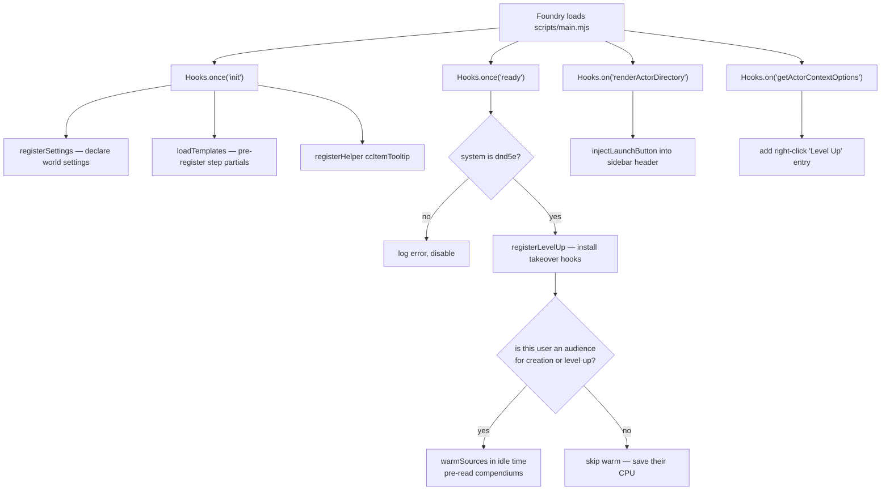
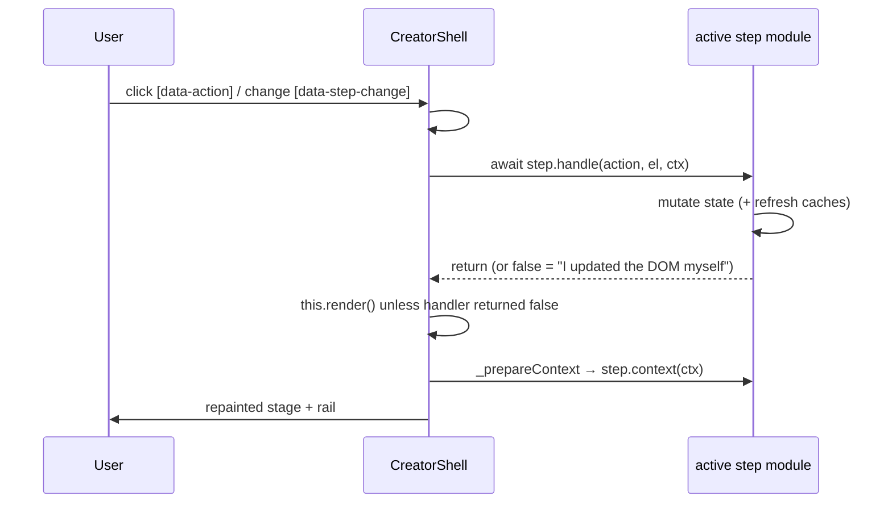
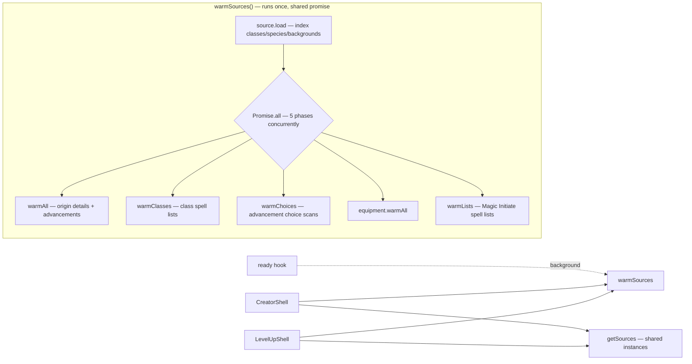
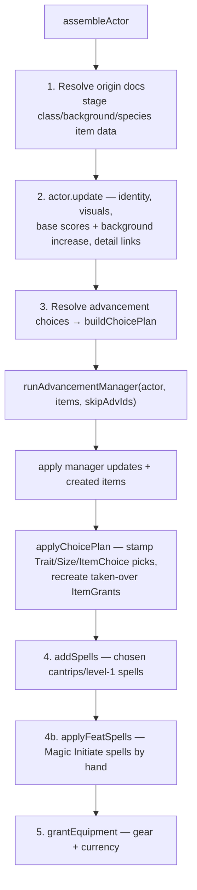
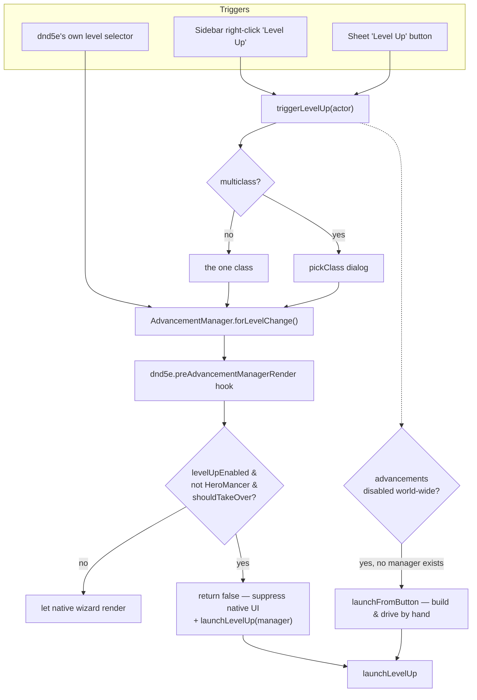
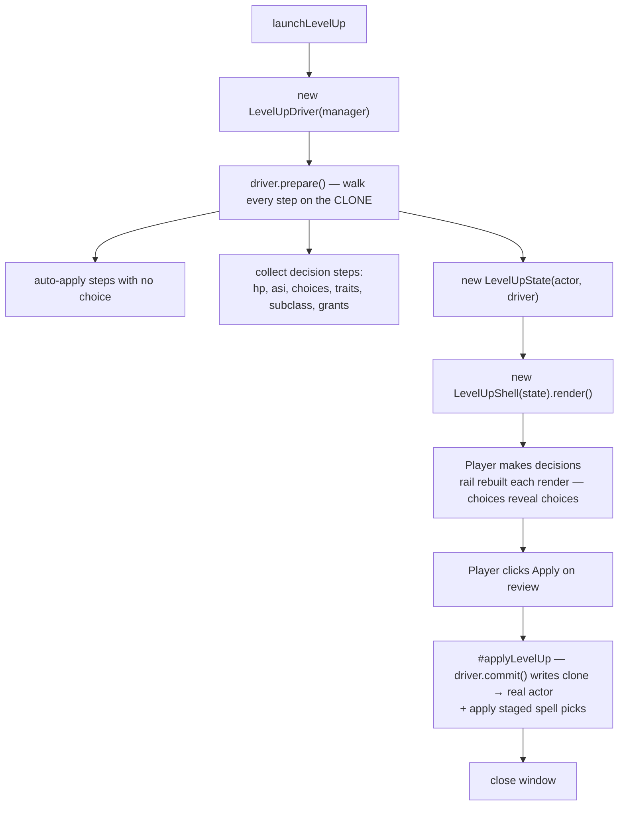

# Technical Guide

A tour of the **Simple D&D Character Creator** codebase for someone joining the team. It explains
*what* the major pieces are, *why* they are shaped the way they are, and *how* control flows from a
button click all the way to a fully-built (or levelled-up) character. Read it top to bottom once;
after that, use it as a map.

The source itself is heavily commented — most files open with a note. This document sits above those comments and ties them together.

---

## 1. What this project is

This is a **Foundry VTT module** for the **dnd5e game system**. Foundry is a virtual tabletop; a
"system" (dnd5e) adds the rules, actor sheets, and content; a "module" (us) layers extra behaviour on
top. We do two things:

1. **Character creation** — a fullscreen, step-by-step wizard that replaces dnd5e's drag-and-drop
   setup. Pick a class, background, species, roll stats, choose spells, name the character, click
   **Create**.
2. **Level-up takeover** — when a player levels a character, we intercept dnd5e's native advancement
   wizard and run our own themed one instead.

Both features are optional and gated by a world **mode** setting (see [§9](#9-settings--module-modes)).

### The Foundry concepts you must know

| Term | What it means here |
|------|--------------------|
| **Hook** | Foundry's event bus. `Hooks.once("init", fn)` / `Hooks.on("renderActorSheet", fn)`. We wire ourselves into the app lifecycle and UI render events through hooks. |
| **ApplicationV2** | Foundry's modern window/app base class. Our two windows (`CreatorShell`, `LevelUpShell`) subclass it. |
| **Handlebars templates** (`.hbs`) | The HTML for our windows. ApplicationV2 renders them from a plain data object we build. |
| **Document** | A Foundry data record — an Actor, an Item, etc. |
| **UUID** | A document's global address, e.g. `Compendium.dnd5e.classes.Item.abc123`. `fromUuid(uuid)` fetches it (async); `fromUuidSync` returns it if already cached. |
| **Compendium / pack** | A content library (classes, spells, gear) shipped by a system or module. |
| **Advancement** | A dnd5e rule attached to an item that fires when you gain it or level up — grant a feature, choose a skill, raise an ability. Understanding these is most of the work in this module. |

---

## 2. Directory layout

```
scripts/
  main.mjs            Entry point. Registers hooks, settings, launch buttons.
  config.mjs          Constants + tiny UI-free helpers. Every layer imports from here.

  app/
    creator-shell.mjs     The creation window (ApplicationV2). Owns navigation + dispatch.

  state/
    creator-state.mjs     The "form data" for the whole wizard. Single source of truth.

  steps/                  One module per creation step. Each is a plain object (a "step contract").
    registry.mjs          The ordered list of steps the shell walks.
    class-step.mjs, background-step.mjs, spells-step.mjs, choices-step.mjs, ...

  data/                   Read-only compendium loaders + resolvers. No DOM, no state.
    source-cache.mjs      Warm-once shared cache (singleton) of the three loaders below.
    source-index.mjs      Classes / species / backgrounds → lightweight "cards" + full docs.
    spell-source.mjs      Spell lists per class.
    equipment-source.mjs  Starting-equipment trees → selectable options.
    choice-resolver.mjs   Advancement *choices* (skills, tools, feats…) → flat descriptors.
    quick-build.mjs       "Quick Build" engine — fills the whole state in one click.

  build/                  The only code that writes to the world.
    actor-assembler.mjs   Turns a finished CreatorState into a real Actor.
    advancement-apply.mjs The "run the manager without prompting" machinery.

  levelup/                The level-up takeover. Mirrors the creation structure.
    intercept.mjs         Hooks + trigger paths (button, context menu, native manager).
    manager-driver.mjs    Drives dnd5e's AdvancementManager from the outside.
    levelup-shell.mjs     The level-up window.
    levelup-state.mjs     Per-session record for one level-up.
    steps/                One module per level-up step (hp, asi, choices, subclass…).

templates/            Handlebars .hbs files for both windows.
styles/               CSS (creator, fonts, ember-skin).
lang/en.json          All player-facing text (localisation).
test/                 Vitest unit tests + Foundry shims + curated fixtures.
tools/                Dev tooling (JSON validation, font fetch).
```

**The golden rule of layering:** `config` → `state`/`data` → `steps` → `app`/`build`. Lower layers
never import UI. `data/` and `state/` never touch the DOM or a Foundry Application, which is exactly
why they are unit-testable under plain Node (see [§10](#10-testing--tooling)).

---

## 3. Startup lifecycle

`module.json` points Foundry at `scripts/main.mjs`. Everything begins there, driven by Foundry's
lifecycle hooks.



Key ideas:

- **`init` vs `ready`.** `init` fires before world data loads — the only safe place to register
  settings and templates. `ready` fires once everything is loaded — the only safe place to touch
  actors and install the level-up takeover.
- **Warming at `ready`.** We pre-read the slow compendium data *in the background* so the first
  window opens instantly instead of stalling on disk reads. It is gated to users who will actually
  open a window (can create actors, or own a character while level-up is on) so we never tax clients
  that won't. See [§6](#6-the-warm-once-cache).

---

## 4. The creation flow (button → launch → build)

This is the headline flow. From clicking the launch button to a finished actor on the sheet.

```mermaid
flowchart TD
    A[Player clicks launch button<br/>or resumes an actor] --> B["launchCreator(actor?)"]
    B --> C{creation enabled &<br/>can create actor?}
    C -->|no| C1[warn / return]
    C -->|yes| D["new CreatorShell(actor).render()"]

    D --> E["_onFirstRender → #loadStage()"]
    E --> F["await warmSources()<br/>(instant if pre-warmed)"]
    F --> G[flip #loading = false, render steps]

    G --> H[Player walks the steps]
    H --> H1[Class + Abilities]
    H --> H2[Background]
    H --> H3[Species]
    H --> H4[Details]
    H --> H5[Spells &#40;casters&#41;]
    H --> H6[Choices]
    H --> H7[Feat-Spells &#40;if applicable&#41;]
    H --> H8[Equipment &#40;optional&#41;]
    H --> H9[Review]

    H9 --> I[Player clicks Create]
    I --> J["#onFinish — latch #finished"]
    J --> K{all required steps complete?}
    K -->|no| K1[return]
    K -->|yes| L["Actor.create() if no actor yet"]
    L --> M["assembleActor(state, source, equipment)"]
    M --> N[close window, open actor sheet]

    M -.on error.-> O[delete half-built actor, unlatch, stay open]
```



### The shell is deliberately thin

[`CreatorShell`](../scripts/app/creator-shell.mjs) owns only two things: **navigation** (which step
is active, which are reachable) and a **single event dispatcher**. It contains zero class/ability/
species logic — that all lives in the step modules. The mental model is a render loop:

```
state changes  →  this.render()  →  _prepareContext() rebuilds the view-model  →  Handlebars repaints
```

Three static config blocks make an ApplicationV2 tick, and they are worth memorising because
`LevelUpShell` uses the identical pattern:

- **`DEFAULT_OPTIONS.actions`** — maps a template's `data-action="goto"` to a static method run on
  click.
- **`PARTS`** — the named templates the window is built from (`rail` = left step list, `stage` = main
  panel). Splitting them lets us re-render just the rail without redrawing the image-heavy stage.
- **`_prepareContext()`** — builds the plain data object the templates render with. Templates never
  see live state, only this snapshot.

### The step contract

Every step in [`steps/registry.mjs`](../scripts/steps/registry.mjs) is a plain object implementing the
same informal interface. This is composition over inheritance — the shell calls these hooks without
knowing what any step does:

```js
{
  id, icon, labelKey, template,        // identity + which .hbs to render
  context(ctx),                        // async → the data the template needs
  handle(action, el, ctx),             // respond to a click/change; return false to skip re-render
  isComplete(state),                   // SYNCHRONOUS gate — is this step done?
  incompleteHint(state, source),       // why Next is greyed
  summary(state, source),              // one-line rail summary
  applicable?(state),                  // false → shown but greyed (e.g. Spells for a non-caster)
  hideWhenInapplicable?, onEnter?      // fully hidden until relevant (e.g. Feat-Spells)
}
```

**Why `isComplete` must be synchronous:** the shell recomputes completion on *every* render to drive
the Back/Next buttons and rail ticks. It can't await compendium reads there. That constraint is the
reason `CreatorState` carries all those `…Cache` / `…Info` fields — steps pre-resolve async data into
the state when a selection changes, so the synchronous gate can read it later. See
[§5](#5-creatorstate-the-single-source-of-truth).

### The dispatch loop

Every UI interaction funnels through one method, `#dispatch`:



The `return false` escape hatch exists for cases where a full re-render would visibly flicker (the
point-buy steppers rebuild class icons; the Details name-roller rebuilds the portrait). Those handlers
patch the DOM in place and skip the render.

---

## 5. `CreatorState`: the single source of truth

[`CreatorState`](../scripts/state/creator-state.mjs) is the "form data" for the whole wizard. Steps
read and write its fields; **nothing is saved to the world until Create.** Field categories recur:

- **Selections** — `classUuid`, `speciesUuid`, `backgroundUuid`, stored as compendium UUIDs.
- **`…Cache` / `…Info` fields** — pre-resolved data (`choiceCache`, `spellInfo`, `backgroundAsi`,
  `featSpellCache`) so the *synchronous* `isComplete` gates can run without awaiting.
- **`Transient …` fields** — pure UI state (active tab, focused row); never persisted.
- **`reset…` methods** — clear everything keyed to a selection when that selection changes, so a
  spell list or skill pick from a previous class never leaks across (`resetClassDependent`,
  `resetSourceChoices`).

**Resuming:** the constructor calls `#prefillFromActor`, mapping an existing actor's class/background/
species items back to the UUIDs that produced them (via each item's `_stats.compendiumSource`), plus
its ability scores and details. That's how re-opening the builder resumes rather than restarts.

---

## 6. The warm-once cache

The three data loaders hold only compendium-derived caches — no per-session state — so
[`source-cache.mjs`](../scripts/data/source-cache.mjs) builds **one** shared set per world session and
reuses it across every window.



Why it's shaped this way:

- **Shared in-flight promise.** If ten windows ask at once, the work runs once and everyone awaits the
  same promise (`warming`). A failed warm drops the promise so a later open can retry.
- **Memoised *promises*, not values.** Inside each loader (`#details`, `#asi`, `#groups`…) the maps
  store the in-flight promise, so concurrent callers converge on a single load instead of racing.
- **Cards vs full documents.** A "card" is a tiny `{uuid, name, img, identifier}` record — cheap to
  list hundreds of in a grid. The full document (description, advancements) is only resolved via
  `fromUuid` when a card is actually opened.
- **Staleness.** If the GM changes which compendiums are enabled, the cached "pack signature" no
  longer matches, `isStale()` returns true, and the shell rebuilds.

---

## 7. The build: `assembleActor`

This is the **only** place that writes to the world. Everything before it just mutated the in-memory
`CreatorState`. [`actor-assembler.mjs`](../scripts/build/actor-assembler.mjs) runs a fixed sequence:



Two Foundry write APIs do all the work: `actor.update(changes)` (dotted-path field writes) and
`actor.createEmbeddedDocuments("Item", [...])` (adds items). `render: false` on those calls stops the
sheet redrawing after every write, so the build doesn't flicker.

### The "skip and re-apply" trick (advancement-apply.mjs)

Normally, adding a class to an actor pops up dnd5e's **AdvancementManager** wizard, asking the player
every choice again. We already asked all that in our own UI, so we must not prompt again. The trick,
in [`advancement-apply.mjs`](../scripts/build/advancement-apply.mjs):

1. **`buildChoicePlan`** — work out which advancements the wizard already resolved (skip them) and
   which granted-feature `ItemGrant`s must be recreated by hand ("takeovers", because their
   sub-features carry their own nested choices).
2. **`runAdvancementManager`** — run the manager *non-interactively* with the skipped advancements
   removed, and grab its resulting updates/items.
3. **`applyChoicePlan`** — stamp the player's Trait/Size/ItemChoice picks and recreate the taken-over
   ItemGrants directly, by calling each advancement's own `apply()` method.

If any of this throws after `Actor.create` succeeded, `#onFinish` deletes the half-built actor so a
retry starts clean instead of stacking a second set of items on a partial one.

---

## 8. The level-up flow (button/hook → takeover → advancement)

The level-up feature mirrors the creation structure (thin shell, step modules, shared cache) but works
by **wrapping dnd5e's native advancement engine** instead of assembling a fresh actor. It is installed
once at `ready` by `registerLevelUp()`.

### The three trigger paths and the intercept



The clean interception point is the **`preAdvancementManagerRender`** hook: it fires just before the
native wizard paints, and returning `false` cancels it — leaving us to open our shell in its place. We
only claim level-ups we can *fully* handle (`LevelUpDriver.canDrive`); anything else falls through to
the native flow untouched. Both trigger buttons route through the same manager the native selector
builds, so all paths converge on the same hook.

### Driving the manager and committing



Why a **driver** exists ([`manager-driver.mjs`](../scripts/levelup/manager-driver.mjs)): dnd5e's
`AdvancementManager` keeps its whole pipeline private and its `render()` aborts the moment our hook
returns `false`, so we can't ask it to step for us. Instead we take the manager it already built —
which holds the `actor`, an in-memory `clone`, and a fully-enumerated `steps` array — and **re-run the
relevant parts of its pipeline ourselves against the clone**. The real actor is never touched until
`commit()`, so a cancelled level-up rolls back for free by discarding the driver.

"Synthesis" is the wrinkle: choosing a subclass or feat can spawn *new* advancement steps mid-walk;
`prepare()` detects those new items and folds their decisions in. The rail can therefore grow between
renders, which is why `LevelUpShell` rebuilds its step list (`buildSteps`) on every render rather than
once.

---

## 9. Settings & module modes

All settings are registered in `main.mjs#registerSettings` and read through helpers in
[`config.mjs`](../scripts/config.mjs). The most important is **mode**:

| Mode | Creation? | Level-up? |
|------|-----------|-----------|
| `creation` | ✅ | ❌ (native flow untouched) |
| `creation-levelup` *(default)* | ✅ | ✅ |
| `levelup` | ❌ | ✅ |

Two other modules change the effective mode:

- **Ember active** → mode is pinned to `levelup` (Ember ships its own creator, so we cede creation and
  re-skin our level-up window to match it via `styles/ember-skin.css`).
- **Hero Mancer active** → we stand down from level-up entirely (it replaces dnd5e's advancement
  engine rather than wrapping it, so wrapping would double up).

`creationEnabled()` and `levelUpEnabled()` are the gates every entry point checks. Read them rather
than the raw setting.

---

## 10. Testing & tooling

The `data/` and `state/` layers are pure logic with no DOM or live Foundry, which makes them
**unit-testable under plain Node with Vitest**.

- **`test/helpers/foundry-shims.mjs`** — installs just-enough stand-ins for the Foundry globals the
  pure code reaches (`game`, `CONFIG`, `Roll`, `fromUuid`…). Loaded via Vitest `setupFiles` before any
  test imports, so importing source doesn't throw on a missing global. Call `installFoundryShims()` in
  `beforeEach` to reset.
- **`test/fixtures/dnd5e-5.3.3.mjs`** — faithful, trimmed transcriptions of *real* dnd5e pack source
  documents (fighter, human, sage, magic-initiate, wizard). Real `_id`s, real advancement
  `configuration` shapes, real trait keys are kept verbatim, so the logic under test sees exactly what
  the live system feeds it. **When dnd5e bumps a version and reshapes an advancement, these fixtures
  are where the regression surfaces** — refresh them from the pack source.

Commands (from `package.json`):

```bash
npm test               # vitest run
npm run lint           # eslint scripts test
npm run validate:json  # parse module.json + lang files (catch stray commas before the live game does)
npm run check          # all three — the pre-push gate
```

`eslint.config.mjs` declares the Foundry/dnd5e globals as read-only so lint doesn't flag them as
undefined.

---

## 11. Conventions & gotchas

- **Localisation.** No player-facing string is hard-coded. Everything goes through `t("key")` (or
  `t("key", data)` for `{placeholders}`), which resolves against `lang/en.json` under the module
  namespace. Call `t()` only after i18n is ready — never in static field initialisers.
- **`race` means species.** dnd5e's item type for a species is historically `"race"`. You'll see
  `#cards.race`, `type === "race"`, `system.details.race` throughout — that's species.
- **`#private` fields** are real JavaScript private fields (only reachable inside the class), used
  heavily for the shells' internal state and the loaders' memo maps.
- **Diagnostics scaffolding.** `intercept.mjs#onPreAdvancementManagerRender` has a `console.table`
  block that reports why we did/didn't take over a level-up. It only logs; it's safe to strip once the
  takeover is fully stable.
- **Windows/PowerShell dev environment.** The repo is developed on Windows; the Bash tool is available
  for POSIX scripts but PowerShell is primary.

---

## 12. How to add a new creation step

1. Create `scripts/steps/my-step.mjs` exporting a step object implementing the
   [step contract](#the-step-contract).
2. Create `templates/steps/my-step.hbs`.
3. Add any state fields it needs to `CreatorState` (with a `reset…` if they depend on a selection).
4. Import and insert the step into the `STEPS` array in `steps/registry.mjs` at the right position —
   the shell reads that array to drive the whole stepper, so ordering and completion "just work".
5. If the step is only sometimes relevant, add `applicable(state)` (shown-but-greyed) or
   `hideWhenInapplicable` + `applicable` (fully hidden until relevant).
6. Add its player-facing text to `lang/en.json` and, if it has pure logic, a test under `test/`.

Because navigation, completion, and rendering are all data-driven off `STEPS` and the step contract,
you rarely touch the shell itself.
